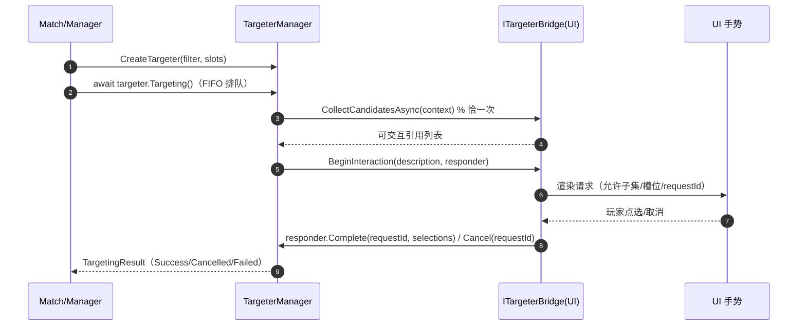

# 06 · 目标选择（异步倒置）

> **覆盖**：⑭ 目标选择——引擎向 UI 索取选择的统一形态（对应 kards-diy 的 `chooser`/`KG.ask`）。
> **内容边界**：含 targeter 发起、桥接契约、应答三态。**不含**：谁发起选靶（→ [`04`](04-打出与部署.md)/[`05`](05-指挥与交战.md)）、候选的业务规则（见各流程判定器）。
> **相关文件**：[`04`](04-打出与部署.md)（选空槽）、[`05`](05-指挥与交战.md)（选攻击目标）、[`01`](01-对局初始化与终局.md)（换牌专用槽）。

---

## ⑭ 目标选择（异步倒置）

### 触发 / 前置
- 引擎在某动作执行中需要玩家选择时，经 `TargeterManager` 发起；**UI 必须实现并注入 `ITargeterBridge`**（`Match` 构造时传入），否则以失败结局暴露（`TargetingEndReason.BridgeNotAssembled`，不抛）。

### 分步骤表（引擎侧发起 → UI 应答）

| 步 | 代码位置 | 语义 |
|---|---|---|
| 1 | `TargeterManager.CreateTargeter(filter, slots, context)` | 建请求对象 `Targeter`（入 FIFO 队列） |
| 2 | `Targeter.Targeting()` | 异步发起，等待终局（`Task<TargetingResult>`） |
| 3 | `ITargeterBridge.CollectCandidatesAsync(context)` | 候选收集——**每次恰一次**；提交"前端当前可交互的完整引用列表"（`Ref<Entity>`） |
| 4 | `ITargeterBridge.BeginInteraction(description, responder)` | 交互开始——把请求描述交给 UI（允许子集 + 槽位 + `requestId`） |
| 5 | `ITargetingResponder.Complete(requestId, selectionsBySlot)` / `Cancel(requestId)` | 玩家手势完成/取消 → 应答 |
| 6 | — | 成功 → `TargetingResult.Success`（`Outcome` 非 null）；取消/失败 → 对应状态 |

### 应答契约（`ITargetingResponder`）

| 成员 | 说明 |
|---|---|
| `Complete(requestId, IReadOnlyDictionary<string, IReadOnlyList<Ref<Entity>>>)` | 引用类便捷面 |
| `Complete(requestId, …IReadOnlyList<TargetSelection>)` | 类别化面（支持引用元素 `FromReference` / 标识元素 `FromIdentifier` 混合槽位） |
| `Cancel(requestId)` | 前端主动放弃 |

**关键契约**：
- **`requestId` 配对**：`Complete`/`Cancel` 必须回传 `description.RequestId`；不匹配 = 违规（拒绝 + 留痕 + 请求继续等待）。
- **`false` ＝ 拒绝（非终局）**：内容不合规（数量/成员/失效/类别不符）＝显式拒绝，请求**继续等待**，可纠正重试或 `Cancel`。
- **终局恰一次**：成功/取消/失败后，后续调用幂等忽略。
- **排队不取消**：`TargeterManager` 是全局 FIFO 串行队列；**未 Begin 的排队请求不可取消**。
- **产出**：成功后经 `TargetingResult.Outcome`（`TargetOutcome`）读取：`Single` / `List` / `GetSelection(slotName)` / `GetIdentifiers(slotName)` / `GetSlotKind(slotName)`。

### 请求描述（`TargetingRequestDescription`）
携带 `RequestId`、`AllowedTargets`（允许子集）与 `Slots`（槽位描述：`Name`/`Kind`/`Min`/`Max`/`Presentation`，以及按类别的 `AllowedReferences`/`Options`/`CardListings`）。**未返回项与淘汰项的"置黑"由 UI 负责**。

### 时序图

### 关联效果预制体
- 无独立模板；目标选择由引擎/效果 handler 按需发起。

### 前端对接要点
- **必须实现 `ITargeterBridge` 并注入**；`CollectCandidatesAsync` 在**出队执行时**被调用（保证候选新鲜度），不要入队前预先收集。
- 判断终局用 `TargetingResult.Status`；`Complete` 返回 `false` 时按"拒绝、可重试或 `Cancel`"处理。
- 换牌用**专用槽位** `MulliganSelectSlot`（专用 Kind/呈现标注），前端据此播放专属动画。

### 能力现状
- 多选候选面板已支持混合槽位；"置黑/淘汰项"标记由 UI 自行推导（引擎不产出置黑标记）。
